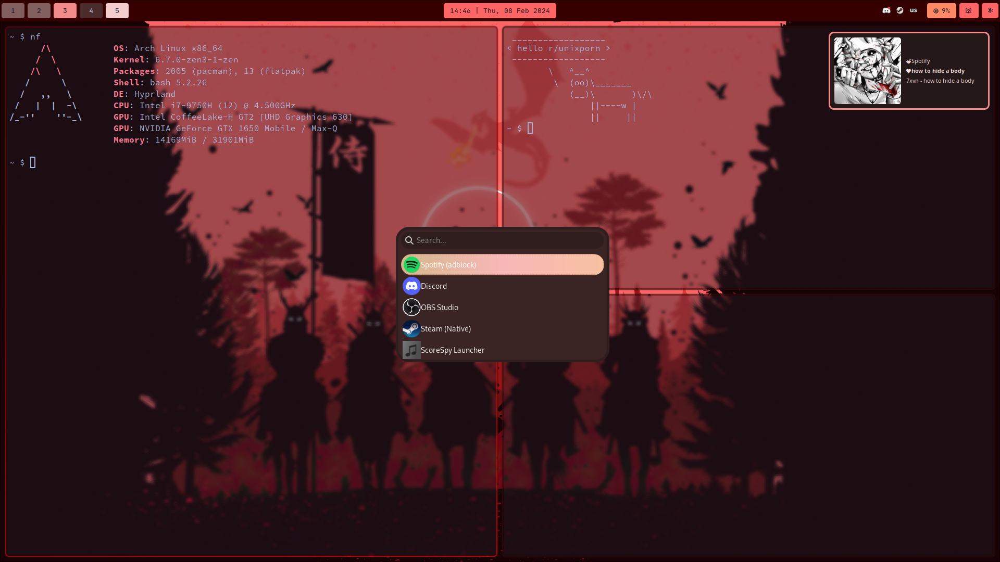

# HyprDots
My Hyprland (and related) dotfiles.

## Required Software
All names are their Arch/AUR package names
- hyprland-git
- hyprshot
- waybar-git
- hyprpaper
- dunst
- neofetch
- wofi
- wofi-emoji
- alacritty
- pavucontrol
- polkit-kde-agent
- brightnessctl

#### LIST MAY NOT BE COMPLETE UNTIL FULL RELEASE

This will be installed in a later step, this is just to be transparent.

## Installation
Method 1 (Script):
- **Check back later, WIP**

Method 2 (Manual):
- Install required software: `yay -Sy hyprland-git hyprshot waybar-git hyprpaper waybar-git hyprpaper dunst neofetch wofi wofi-emoji alacritty pavucontrol polkit-kde-agent brightnessctl`
- Git clone the repo: `git clone https://github.com/JustASpeedrunner/hyprdots`
- Cd into the folder: `cd hyprdots`
- Copy the files into your .config folder: `cp -r .config/* ~/.config/`
- And you're done! 
  - Note: Some applications may need to restart before changes take effect, waybar and dunst being the main examples.

## Some things to note
I use Colemak as opposed to QWERTY, so my keybinds are in different places than you may expect them. I did set the keyboard layout to QWERTY in the dotfiles but I didn't change the keybinds to where they would be on Colemak, so by all means change them to your liking.

Also, I am on a laptop so my monitor setup will be different from yours, change the config accordingly in `hypr/hyprland.conf` and in `hypr/hyprpaper.conf`.

Having issues? Make an issue here or check out the `sys.hyprdots` category in my [Discord Server](<https://discord.gg/JPnDTDPp7q>).

## Keybinds
Applications
- App launcher (`wofi --show drun`): `SUPER + D`
- Emoji picker: `SUPER + .`
- Alacritty: `SUPER + ENTER`
- Librewolf: `SUPER + N`
- Thunar: `SUPER + E`
- Hyprshot (Regional, clipboard-only): `PRINT`
- Hyprshot (Window, clipboard-only): `SHIFT + PRINT`
- Hyprshot (Output, clipboard-only): `SUPER + PRINT`
- Waybar: `SUPER + SHIFT + ALT + W`
- Kill active window: `SUPER + SHIFT + Q`
- Exit Hyprland: `SUPER + SHIFT + ESC`

Tiling
- Toggle floating: `SUPER + V`
- Toggle window split (Vertical/Horizontal): `SUPER + J`
- Move to workspace: `SUPER + <number>`
- Scroll through workspaces: `SUPER + MWHEEL<UP/DOWN>`
- Move active window to # workspace: `SUPER + SHIFT + <number>`
- Move active window to special workspace: `SUPER + M`
- Toggle special workspace: `SUPER + K`
- Maximize active window: `SUPER + F`
- Fullscreen active window: `SUPER + SHIFT + F`
- 'Alt-tab'-esque (cycle focus, bring to top): `SUPER + TAB`
- Move focus with arrow keys: `SUPER + <arrowkey>`
- Resize windows: `SUPER + RMB`
- Move windows: `SUPER + LMB`

Misc.
- Raise/Lower volume: `XF86Audio<Raise/Lower>Volume`
- Mute audio: `XF86AudioMute`
- Raise brightness: `XF86Sleep` or `XF86MonBrightnessUp`
- Lower brightness: `SHIFT + XF86Sleep` or `XF86MonBrightnessDown`